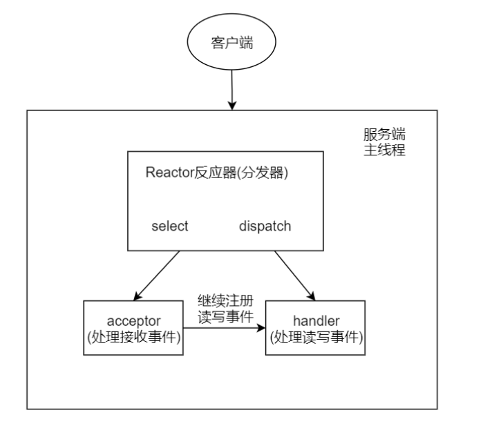
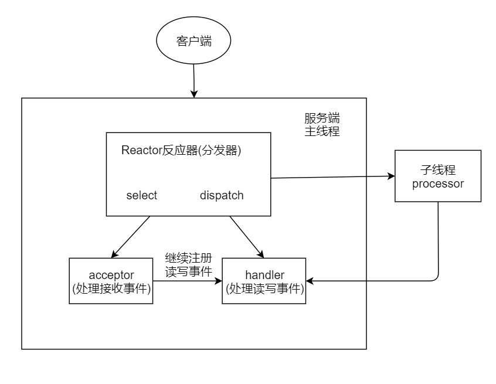
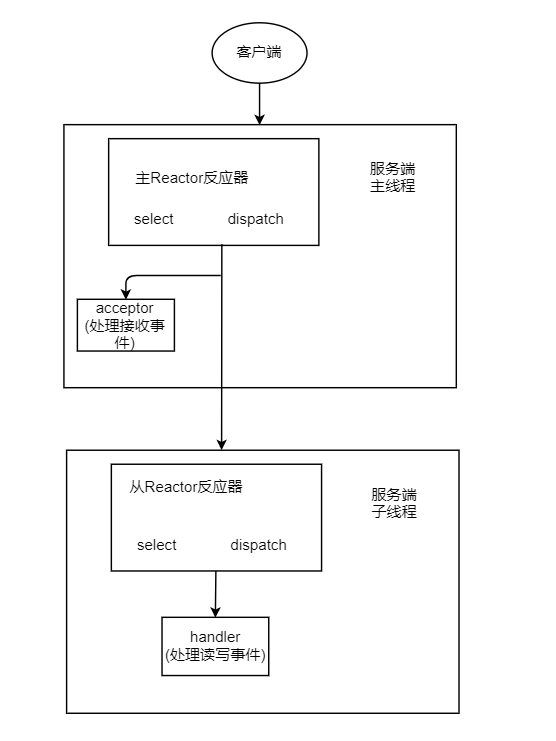

# Netty 项目

## (一) NIO Demo

需求分析： 群聊系统
    实现服务端和客户端之间的通讯（非阻塞）

1） 客户端发送数据，服务端能够一直接收。
2） 多个客户端发送的数据，彼此相互可见。
            服务端能够广播给其他客户端，除了发送数据的客户端之外

服务器： ServerSocketChannel
1)   监听端口，获得和客户端的连接
2）获取的是 SocketChannel， 注册给选择器，并且声明监听事件（读写）
3）在读数据后，将此数据再写入给其他客户端

## (二) NIO线程模型

Reactor模型定义
1）事件驱动
2）可以处理一个或多个数据源
3）通过多路复用将请求的事件分发给对应的处理器处理

三大核心角色：Reactor  Acceptor  Handler

Reactor：监听事件的发生，并分发给对应的handler处理，或者分发给acceptor
Acceptor： 处理客户端连接事件，并创建handler
Handler：处理后续的读写事件

#### 【单Reactor单线程模型】

select一直监听事件，事件发生后触发dispatch。
如果事件是建立请求的事件，又acceptor去创建handler来处理业务的
如果不是建立请求的事件，找到对应的handler处理业务。

注： redis就是这样处理的

#### 【单Reactor多线程模型】

和单线程模型的主要区别，是具体业务逻辑不由handler处理，handler只负责读数据，将数据传给子线程，子线程处理完再将结果返回给handler，handler再发送给客户端。

#### 【主从Reactor模型】

主reactor， 用来处理连接的请求和时间，有连接就分配给acceptor。然后分配给从reactor，让从reactor创建对应的handler，并可以监听后续的读写事件。
不是连接事件时，分配给 “从reactor” , 从reactor去查找对应的handler。

类比于餐厅的接待员和服务员

1）单Reactor单线程： 接待员和服务员是同一个人，一直服务
2）单Reactor多线程：一个接待员和多个服务员
3）主从Reactor：两个接待员和多个服务员

