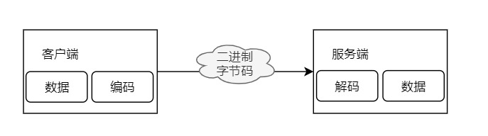
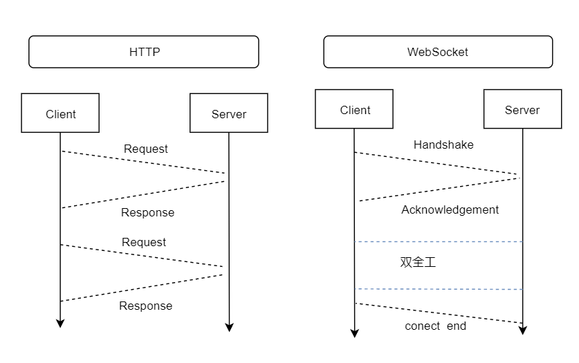

# Netty 项目


## (一) NIO Demo

需求分析： 群聊系统
    实现服务端和客户端之间的通讯（非阻塞）

1） 客户端发送数据，服务端能够一直接收。
2） 多个客户端发送的数据，彼此相互可见。
            服务端能够广播给其他客户端，除了发送数据的客户端之外


服务器： ServerSocketChannel
1)   监听端口，获得和客户端的连接
2）获取的是 SocketChannel， 注册给选择器，并且声明监听事件（读写）
3）在读数据后，将此数据再写入给其他客户端


## (二) NIO 线程模型

Reactor模型定义
1）事件驱动
2）可以处理一个或多个数据源
3）通过多路复用将请求的事件分发给对应的处理器处理

三大核心角色：Reactor  Acceptor  Handler

Reactor：监听事件的发生，并分发给对应的handler处理，或者分发给acceptor
Acceptor： 处理客户端连接事件，并创建handler
Handler：处理后续的读写事件

#### 【单Reactor单线程模型】


select一直监听事件，事件发生后触发dispatch。
如果事件是建立请求的事件，又acceptor去创建handler来处理业务的
如果不是建立请求的事件，找到对应的handler处理业务。

注： redis就是这样处理的

#### 【单Reactor多线程模型】


和单线程模型的主要区别，是具体业务逻辑不由handler处理，handler只负责读数据，将数据传给子线程，子线程处理完再将结果返回给handler，handler再发送给客户端。


#### 【主从Reactor模型】


主reactor， 用来处理连接的请求和时间，有连接就分配给acceptor。然后分配给从reactor，让从reactor创建对应的handler，并可以监听后续的读写事件。
不是连接事件时，分配给 “从reactor” , 从reactor去查找对应的handler。


类比于餐厅的接待员和服务员

1）单Reactor单线程： 接待员和服务员是同一个人，一直服务
2）单Reactor多线程：一个接待员和多个服务员
3）主从Reactor：两个接待员和多个服务员


#### 【Netty模型】

主从Reactor对应到netty中， BossGroup 和  WorkerGroup  —>  NioEventLoopGroup
BossGroup  负责接收客户端的连接
WorkerGroup  负责网络的读写

NioEventLoopGroup 是一个事件循环组，组中包含很多个事件循环
  NioEventLoop  代表一个不断循环处理任务的线程   每一个都有selector 用于监听


BossGroup   
1)  轮询是否有accept事件发生
2）处理事件，并且和客户端建立连接， NioSocketChannel -> SocketChannel -> Socket
      注册到workergroup中，使用seletor进行后续监听
3）处理任务队列

WorkerGroup
1）轮询是否有read and write事件发生
2)   找到 NioSocketChannel
3）处理任务队列


## (三) Netty HelloWorld

### 【Demo 处理逻辑】

1)  创建group,  服务端两个，分别为boss和worker，客户端一个

2)  启动对象初始化
ServerBootstrap  和  Bootstrap
对于服务端而言，先后设置其中的线程组group、通道channel、处理器handler、客户端通道对应的处理器childHandler

其中自定义handler的设置，需要先有通道初始化器ChannelInitializer<SocketChannel>，实现其中的通道初始化方法，具体逻辑为 获取通道中的管道，然后加入handler

注：通道是建立连接的角色  管道是管理业务处理逻辑

**其中handler的逻辑如下**
a) 继承ChannelInboundHandlerAdapter, 此为netty提供的适配器
b) 重写其中的方法，channelActive 、channelRead、channelReadComplete，分别对应于通道创建、读事件发生、读事件完成三个时间点。
c)  方法的参数有一个 ChannelHandlerContext ，是处理器的上下文，除了获取通道和管道外，可以调用writeAndFlush() 直接写入数据

3）然后绑定端口号(服务端)， 或者连接指定的ip地址加端口号（客户端）
4）关闭group


### 【组件说明】

```
ChannelFuture类
```

异步的调用方式，调用者并不会立刻获得结果，Future-Listener机制，在调用完成时，通过回调callback的方式获得最终的结果。


```
Unpooled类
```

是netty提供的，用来操作缓冲区（数据容器）的工具类
copiedBuffer  可以将给定的数据和编码，返回ByteBuf对象


## (四)  Netty Demo

需求如NIO Demo, 群聊系统




Netty 提供了编码器和解码器
StringEncoder /  StringDecoder    对字符串处理
ObjectEncoder /  ObjectDecoder   对java对象处理


```
SimpleChannelInboundHandler类
```

继承于ChannelInboundHandlerAdapter, 重写了channelRead方法，需要自行实现channelRead0方法，好处之一是不用关心何时释放资源，底层做了处理。


### 【Demo编写逻辑】

Server And Client  

 1）  创建EventLoopGroup，注入ServerBootstrap中，理解其中的新参数

```
// 服务端暂时无法处理的连接会放在请求队列中
// backlog 指定了队列的大小
.option(ChannelOption.SO_BACKLOG,128)
// 设置保持连接状态
.childOption(ChannelOption.SO_KEEPALIVE,true)
```

 2） 创建通道初始化器  

​        实现初始化方法时， 增加编码解码器，以及自定义处理器。

3） 创建自定义处理器

​        继承的父类是SimpleChannelInboundHandler
​        a)  感知连接状态的变化对应的方法是  handlerAdded 、handlerRemoved
​        b)  感知通道是否是活跃状态的方法是  channelActive 、 channelInactive
​        c)  当出现异常时需要关闭上下文  exceptionCaught
​        d)  真正读数据的逻辑在  channelRead0 方法之中
​        
​        处理多个通道的方式  ChannelGroup ，本质上是set。 通过遍历set实现消息广播。
​        当通道是自身时，增加了人机对话。            

4） 客户端的区别

​        连接服务端后，保持监听，接收键盘输入后，直接写入通道。


## (五)  Netty Http服务


#### 【Http简述】

应用层协议，默认是80端口，最早推出1991年。

```
Get  /index.html

<html>
   <body> hello world</body>
</html>
```


五年后，1.0版本发布，不只文本可以发送，任何格式内容都支持。
提供了POST和HEAD，以及更改了请求和响应的格式，增加了头信息。

##### 【content-type字段】

声明数据格式及其编码 （服务端声明给客户端使用的）
text/html   text/plain  
image/png  ....
application/javascript

```
Content-Type: text/html; charset=utf-8
```

一级类型 和  二级类型


##### 【Accept字段】

客户端声明可以接收的数据格式

```
Accept: */*
```


##### 【Accept-Encoding字段】

```
Accept-Encoding: gzip,deflate
```

客户端可以接收哪些压缩方法

对应Content-Encoding


此时，每个TCP连接只能发送一次请求，发送完成即关闭，性能较差。

为解决1.0版本，对TCP连接的使用成本过高问题，推出Connection。

##### 【Connection字段】

```
Connection: keep-alive
```


再两年后，推出http/1.1版本

1）引入持久连接的功能，TCP连接默认不关闭，此时无需声明Connection。

2）引入管道机制，在同一个TCP连接里，客户端可以发送多个请求，服务端仍然按照顺序处理和响应，管道管理的是请求的处理逻辑/顺序。

3）增加【content-length字段】声明数据的长度

4）新增 PUT 、DELETE、PATCH、OPTIONS


此版本的缺点：数据按顺序进行，当有前面的响应很慢的时候，出现阻塞，这个现象叫做“队头阻塞”


#### 【Http组成】

请求头、请求数据、数据尾部信息

HttpRequest    HttpContent    LastHttpContent

-》  FullHttpRequest   代表完整的http请求   


Netty提供的关于http的handler：

HttpResponseDecoder  解码器，处理服务端的响应（客户端）
HttpRequestEncoder 编码器，处理服务端的请求（客户端）
HttpRequestDecoder  解码器，处理客户端的请求（服务端）
HttpResponseEncoder  编码器，处理客户端的响应（服务端）

HttpClientCodeC : 编码解码器，用于客户端 HttpResponseDecoder + HttpRequestEncoder 
HttpServerCodeC:  编码解码器，用于服务端 HttpRequestDecoder + HttpResponseEncoder

由于http的请求和响应，可能由很多部分组成，需要聚合成一个完整的消息
HttpObjectAggregator   ->  FullHttpRequest / FullHttpResponse

压缩数据的使用
HttpContentCompressor   压缩，用于服务端
HttpContentDeCompressor   解压缩，用于客户端


#### 【Http Demo 处理逻辑】

1） 创建server
2） 创建初始化器，复习了netty提供的http编码解码器、压缩器、聚合器等等，此时泛型使用Channel
3） 创建handler，泛型使用FullHttpRequest
     a)   新建响应DefaultFullHttpResponse，设定三大参数，分别为http版本、响应码、响应数据
     b）使用HttpHeaders 设置请求头，此时HttpHeaderNames 提供了设置请求头的字段，HttpHeaderValues  提供了请求头字段的常用参数，不要忘记设置长度
     c） read0方法中使用 write 方法 ， 在readComplete  中使用flush
4） 通过浏览器或postman验证 


## (六) WebSocket


#### 【初识】

http协议的缺陷： 通信只能由客户端发起。

需要一种服务端能够主动推送的能力，websocket。

这种双向通信的能力，也叫“双全工” 




协议标识符：   http://127.0.0.1/    ->    ws://127.0.0.1/
支持文本和二进制的数据传输，可以和任意服务器通信。
http协议，是请求和响应，websocket是先握手建立连接，然后一直使用此链接，最终关闭。大大减少通信过程中数据传输的大小，以及频繁创建连接的资源消耗。
是HTML5提出的，让浏览器和服务器通信的方式。

通信的最小单位是帧frame
发送端： 将消息切割成多个帧，发送给服务端
接收端： 接收消息帧，然后将关联的帧进行重新组装，拿到完整的消息


```
GET ws://127.0.0.1:9988  HTTP/1.1
Host: localhost
Upgrade: websocket    // 升级为ws协议的说明
Connection: Upgrade 
Sec-WebSocket-Key: client-random-string
Sec-WebSocket-Version: 13
```

Upgrade: websocket和Connection: Upgrade，标识升级信息。
后两项标识协议版本


```
Http/1.1  101  Switching Protocols
Upgrade: websocket
Connection: Upgrade 
Sec-WebSocket-Accept: server-random-string
```

响应码101，代表http协议更改为websocket协议。


WebSocket实现的本质：

TCP本身是实现了全双工通信，http的请求应答机制其实限制了这种方式，websocket在连接建立之后，不再使用http协议，以此达到互相发送数据的能力。


#### 【客户端】

WebSocket对象，以及相关的事件。

| 事件    | 方法      | 说明                 |
| ------- | --------- | -------------------- |
| open    | onopen    | 连接建立时触发       |
| close   | onclose   | 连接关闭时触发       |
| message | onmessage | 接收服务端数据时触发 |
| error   | onerror   | 发生错误时触发       |


相关方法
send()   使用连接去发送数据
close()  关闭连接

```
var ws = new WebSocket("ws://127.0.0.1");
ws.onopen = function(evt){
   console.log("connection open");
   ws.send("hello websocket");  // 发送数据的方法
};
```


WebSocket连接的状态，使用readyState来声明

CONNECTING   正在连接
OPEN   连接成功可以通信
CLOSING   正在关闭
CLOSED   连接关闭或打开连接失败 


#### 【服务端】

1）WebSocketServer，没什么变化
2）WebSocketInitializer ，除了http的编解码器和聚合器外，还增加了ChunkedWriteHandler（块方式写）和WebSocketServerProtocolHandler（升级协议使用）
3）WebSocketHandler， 继承父类的泛型为TextWebSocketFrame，是数据传输的单位，在channelRead0方法中写数据，也需要给通道传入此类型的对象。


html编写
1）两个文本框，分别用来客户端写数据和读数据（服务端返回）。
2）编写js，判断是否支持websocket，创建websocket对象，设置请求地址，声明处理事件的方法，四大事件对应四大方法
3）一个发送按钮，点击操作触发websocket的send发送数据方法，此时需要判断websocket的状态（四种状态）


